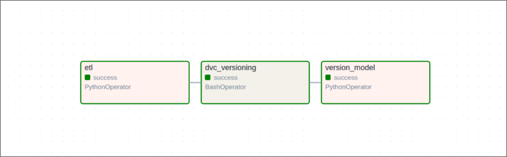

# Big Mart Sales Prediction Pipeline

This repository contains an automated data pipeline for cleaning, versioning, and training a machine learning model to predict sales. The pipeline leverages Apache Airflow for orchestration, DVC (Data Version Control) for data management, and MLflow for model tracking and versioning.

## Table of Contents

- [Overview](#overview)
- [Pipeline Structure](#pipeline-structure)
- [Versioning](#versioning)

## Overview

This project predicts sales for items in retail stores, using data cleaning, versioning, and machine learning training in a fully orchestrated pipeline.

The pipeline performs the following tasks:

1. **Data Cleaning**: Processes and cleans the data to prepare it for training.
2. **Data Versioning**: Uses DVC to save cleaned data versions on Google Drive.
3. **Model Training and Versioning**: Trains the model on cleaned data, tracks versions and metrics using MLflow.

## Pipeline Structure

The pipeline is managed by an Apache Airflow Directed Acyclic Graph (DAG) with three main tasks:

- **ETL**: Runs the data cleaning scripts.
- **DVC Versioning**: Versions the cleaned dataset using DVC, storing it on Google Drive.
- **Model Training**: Loads the dataset, trains the model, and logs the version in MLflow.

## Versioning

- **DVC**: All cleaned data versions are stored and managed with DVC on Google Drive. This enables reproducibility and allows historical data versions to be retrieved as needed.
- **MLflow**: Models are tracked in MLflow, with metrics and parameters logged for each version. Access the MLflow tracking server to review model performance over time.

 

| Airflow Graph                          |
| -------------------------------------- |
|  |
